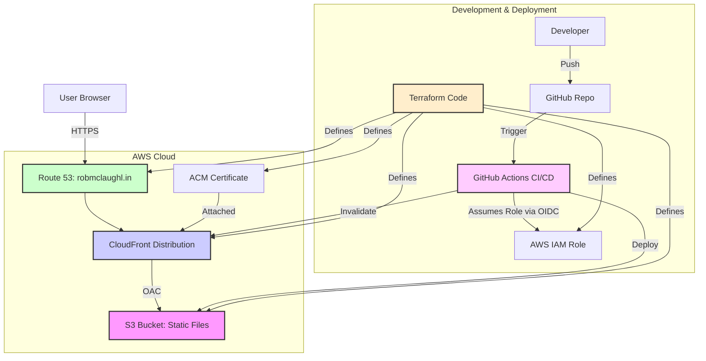

# System Patterns

*This document outlines the system's architecture, key technical decisions, design patterns employed, component relationships, and critical implementation details.*

## System Architecture Overview

*   **Frontend Application:** Single-page application built with Next.js 13 (App Router). Primarily uses Static Site Generation (SSG) for the MVP, resulting in static HTML, CSS, and JS assets.
*   **Hosting:** Static assets hosted on AWS S3.
*   **Delivery:** AWS CloudFront CDN serves assets globally, provides HTTPS via ACM certificate, and points to the S3 origin using Origin Access Control (OAC). Security headers are applied via a CloudFront Response Headers Policy, and access logging is enabled.
*   **DNS:** AWS Route 53 manages the `robmclaughl.in` domain, pointing to the CloudFront distribution.
*   **Infrastructure Management:** All AWS resources are defined and managed using Terraform (Infrastructure as Code).
*   **Deployment Pipeline:** Automated builds and deployments triggered by pushes to the `main` branch via GitHub Actions.

## Key Technical Decisions

*   **Framework Choice (Next.js):** Chosen for performance (SSR/SSG), SEO benefits, TypeScript support, and React ecosystem. App Router used for modern features.
*   **Styling (Tailwind CSS + shadcn/ui):** Utility-first CSS for rapid development and custom styling. Shadcn/ui provides accessible, pre-built components compatible with Tailwind.
*   **Hosting (AWS S3 + CloudFront):** Provides scalable, secure, and performant static site hosting with global CDN delivery, HTTPS, security headers, and access logging.
*   **Infrastructure as Code (Terraform):** Ensures reproducible, version-controlled, and automated management of AWS resources.
    *   **Route53 Management:** Uses hardcoded Zone ID with `allow_overwrite = true` to safely manage existing DNS records.
    *   **S3 Backend:** Stores Terraform state in S3 with DynamoDB locking for team collaboration and state consistency.
*   **CI/CD (GitHub Actions):** Automates the build and deployment process for efficiency and consistency.
*   **Secure AWS Authentication (OIDC):** Avoids storing long-lived AWS credentials in GitHub by using OpenID Connect for temporary role assumption.

## Design Patterns in Use

*   **Static Site Generation (SSG):** Next.js pattern used to pre-render pages to static HTML at build time for maximum performance.
*   **Utility-First CSS:** Tailwind CSS approach for styling.
*   **Component-Based Architecture:** Standard React pattern for UI development. Leveraging shadcn/ui components.
*   **Infrastructure as Code (IaC):** Managing infrastructure through code (Terraform).
    *   **Resource Adoption Pattern:** Using `allow_overwrite = true` and explicit resource IDs to allow Terraform to manage pre-existing resources.
    *   **Remote State Pattern:** Using S3 backend for state storage and DynamoDB for state locking.
*   **Continuous Integration/Continuous Deployment (CI/CD):** Automating build and deployment pipeline (GitHub Actions).

## Component Relationships (MVP)

*   **`app/layout.tsx`:** Root layout likely wrapping the main page content, potentially including global elements like theme providers or metadata.
*   **`app/page.tsx`:** The main page component containing the core content (name, title, links).
*   **`components/*`:** Reusable UI components (e.g., `HeroBackground.tsx`, potentially buttons or icons from `shadcn/ui`). `page.tsx` imports and uses these components.
*   **Styling:** Tailwind utility classes applied directly within components. Global styles in `app/globals.css`.

## Critical Implementation Paths

*   **User Request Flow:** User visits `robmclaughl.in` -> DNS resolves via Route 53 to CloudFront -> CloudFront serves cached static HTML/CSS/JS from edge location (or fetches from S3 origin if not cached) -> Page renders in browser.
*   **Deployment Flow:** Developer pushes code to `main` branch -> GitHub Actions workflow triggers -> Installs dependencies (`pnpm install`) -> Builds Next.js app (`pnpm run build`) -> Assumes AWS IAM role via OIDC -> Uploads static build output to S3 -> Invalidates CloudFront cache.

## Data Management (MVP)

*   **Storage:** All website content is static (HTML, CSS, JS, images/videos) stored as files in an AWS S3 bucket.
*   **Access:** Files are accessed publicly via the AWS CloudFront CDN. Direct S3 access is restricted using OAC.
*   **Caching:** CloudFront provides edge caching for performance. Cache invalidation is triggered on deployment.
*   **Database:** No database is used in the MVP. 